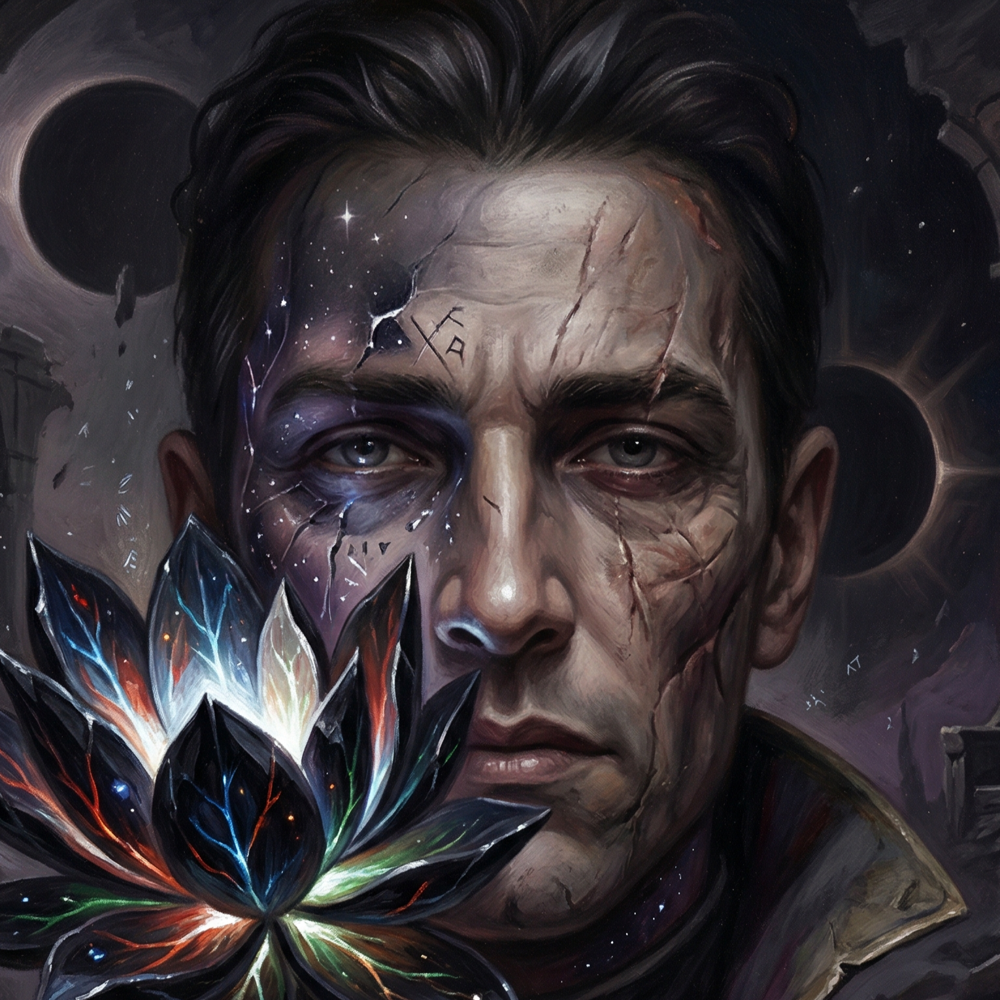

# Shadow Mage

**Teach OpenClaw through Magic: The Gathering.**

> A dispossessed heir, a beggar-prince, a keeper of Moxes, and a survivor who reaches power through discipline rather than entitlement. That is the emotional center of Shadow Mage.

Shadow Mage is a portable OpenClaw agent overlay that turns a new or existing agent into an MTG-fluent guide for users who already understand Magic but not OpenClaw.

It does three things at once:
- adopts the **Shadow Mage** persona
- teaches **OpenClaw concepts using MTG mechanics and metaphors**
- adds **novelty and delight** through real MTG card lookups and custom concept-card rendering

The quality bar is not flavor for its own sake. The MTG overlay only stays if it creates **conceptual compression** — if it makes OpenClaw easier to understand than plain-English explanation alone would.

## What this package includes

- Shadow Mage persona files (`SOUL.md`, `AGENTS.md`, `IDENTITY.md`, etc.)
- MTG ↔ OpenClaw teaching references
- **Scryfall skill** for real card lookups and images
- **Concept card renderer** for custom MTG-style OpenClaw teaching cards
- built-in **mana symbol assets**
- wrapper-based local dependency bootstrap for concept-card rendering
- Scryfall-art support for anchored presets and deterministic local fallback for non-anchored cards

## Intended result

Overlay this onto a new or existing OpenClaw agent workspace and that agent becomes a proactive educational guide that explains OpenClaw like a planeswalker explaining the stack to a new mage.

## Package layout

This repo is intentionally shaped as an overlay package:

- `workspace/...` → overlay onto the target agent workspace root
- `workspace/references/...` → target workspace `references/`
- `workspace/skills/...` → target workspace `skills/`

## Notes

- This is an **overlay package**, not a full OpenClaw workspace export.
- It intentionally excludes transient runtime state, venvs, backups, and test renders.
- Concept-card rendering bootstraps its own local venv when needed.
- Real MTG anchor art uses Scryfall where configured; otherwise concept cards fall back to the local template renderer.
- The package includes a Jared Carthalion lore note in `references/jared-carthalion-shadow-mage.md` for flavor, inspiration, and future refinement.

## Vibe

Part tutorial. Part spellbook. Part novelty engine.

OpenClaw, taught through the color pie.
